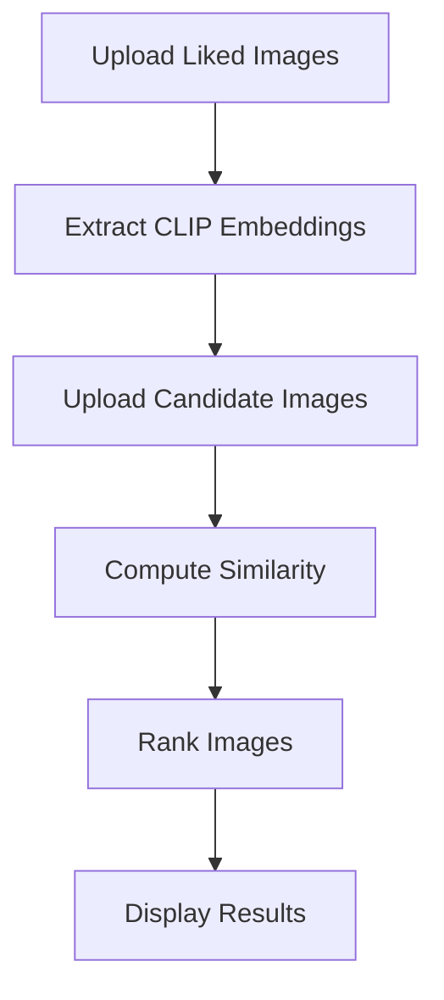

# 🚀 AI Image Selector

> 🧠 AI-powered image ranking system using CLIP + FastAPI + Streamlit

---

## ✨ Demo


---

## 🧠 Features

* 📤 Upload liked & candidate images
* 🔍 Semantic similarity using CLIP
* 📊 Intelligent ranking system
* ⚡ FastAPI backend
* 🎨 Streamlit UI
* 🔐 Secure authentication (JWT)

---

## 🛠️ Tech Stack

| Category | Tools                         |
| -------- | ----------------------------- |
| Backend  | FastAPI                       |
| Frontend | Streamlit                     |
| AI Model | CLIP (Transformers + PyTorch) |
| Database | SQLAlchemy                    |
| Auth     | JWT (python-jose, passlib)    |

---

## ⚡ How It Works



---

## 🚀 Run Locally

```bash
git clone https://github.com/your-username/ai-image-selector.git
cd ai-image-selector

pip install -r requirements.txt

uvicorn app.main:app --reload
streamlit run frontend/streamlit_app.py
```

---

## 🎯 Use Cases

* Image recommendation systems
* E-commerce product ranking
* Content filtering
* AI-based search systems

---

## 💡 Highlights

* 🔥 Real-world AI integration (CLIP model)
* ⚡ Full-stack architecture
* 📈 Scalable backend APIs

---

## 👩‍💻 Author

**Nandini Taneja**

pip install -r requirements.txt
